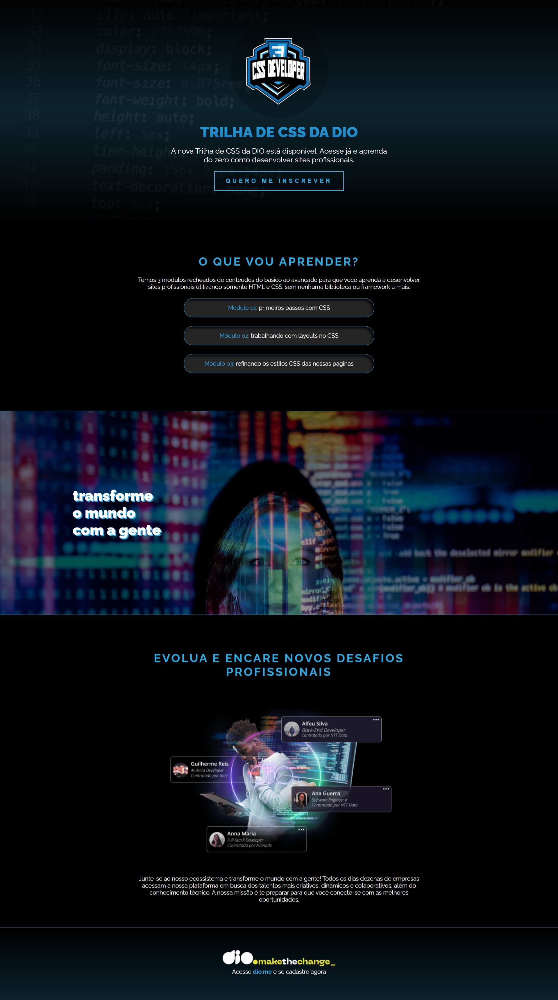

# Desafio 01: Criando sua primeira Landing Page com HTML e CSS

Construção de uma landing page com HTML e CSS, baseada em um protótipo do Figma. O projeto coloca em prática os fundamentos do CSS, o uso das propriedades básicas da linguagem de estilização, além de trabalhar com unidades de medida relativas e absolutas aprendidas ao longo da **trilha de CSS** da [DIO](https://web.dio.me/).

## 💻 Screenshots

## 📱Extras

<table>
  <tr>
    <td align="r">
      
    </td>
    <td>
      
 Adicionei um arquivo <code>responsive.css</code> para tornar a landing page responsiva. 
        Antes, ela não se adaptava bem em telas menores, agora está funcionando muito bem na "versão mobile".
      

    </td>
  </tr>
</table>

## 🔗 Links

- Resultado: [trilha-css-desafio-01](https://mariana4ads.github.io/trilha-css-desafio-01/)
- Base: [link do figma](https://www.figma.com/file/3PiokoJj9IhGDnNiWAJbz7/DIO---Desafio-01?node-id=2%3A6)
